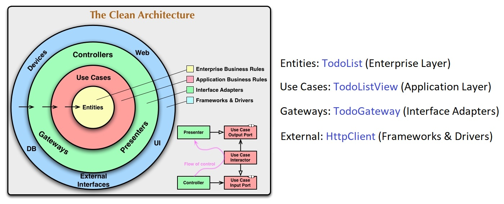

### **Rodrigo Branas** demonstrated how to implement **Clean Architecture's** concepts on Frontend with Vue.js. 
[*As he named it, this application is the Todo List Senior.*]😂
### **This repository is an attempt to convert it to React.**

&nbsp;

` Links from Rodrigo Branas `

- GitHub URL: [https://github.com/rodrigobranas/ports_and_adapters_ca_design_patterns_frontend](https://github.com/rodrigobranas/ports_and_adapters_ca_design_patterns_frontend)
- YouTube URL: [https://www.youtube.com/watch?v=kCSiGeUFi_U](https://www.youtube.com/watch?v=kCSiGeUFi_U)

&nbsp;

` Clean Architecture's Layers from this example `

- **Entities**: TodoList [Enterprise Business Rules]
- **Use Cases**: TodoListView [Application Business Rules]
- **Gateways**: TodoGateway [Interface Adapters]
- **External Interfaces**: HttpClient [Frameworks & Drivers]